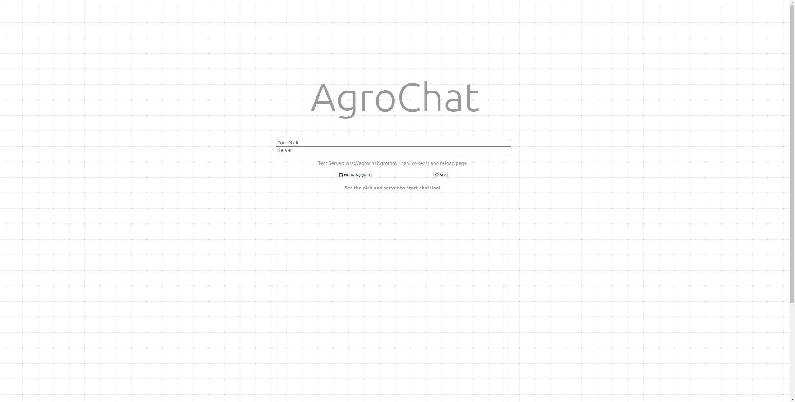

# AgroChat
The simple and clean chat written in Python. It uses websockets technology



## Deploy
To deploy the project you need a [Python](https://www.python.org/) and any HTTP server (I use [Caddy](https://caddyserver.com/))
After installing Python you need to install requared packages:
```
pip install -r requirements.txt
```
Run a server:
```
python main.py
```
By default it serves at localhost:8000 but you can change to use all adresses it in code
```
start_server = websockets.serve(handle_connection, 'localhost', 8000) ->
start_server = websockets.serve(handle_connection, '0.0.0.0', 3000)
```
### Static files deploy
In a 'src' directory use a command:
```
caddy file-server
```
You can learn more at [Caddy's Documentation](https://caddyserver.com/docs/quick-starts/static-files)

## Troubleshooting

### Client
Open developer tools F12 -> Console and check the error

#### Uncaught DOMException: Failed to construct 'WebSocket': The URL '' is invalid.
You need to set the server. If you just wanna test use wss://agrochat.gromov1.repl.co
#### WebSocket connection to 'wss://agrochat.gromov1.repl.co/' failed:
Connection to server failed. Check your internet connection or it might be replit error

### Server
#### ModuleNotFoundError: No module named 'websockets'
You need to install requirements:
```
pip install -r requirements.txt
```

## Roadmap
- [ ] Photos, vidos support
- [ ] Emoji tool
